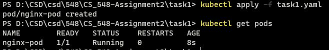
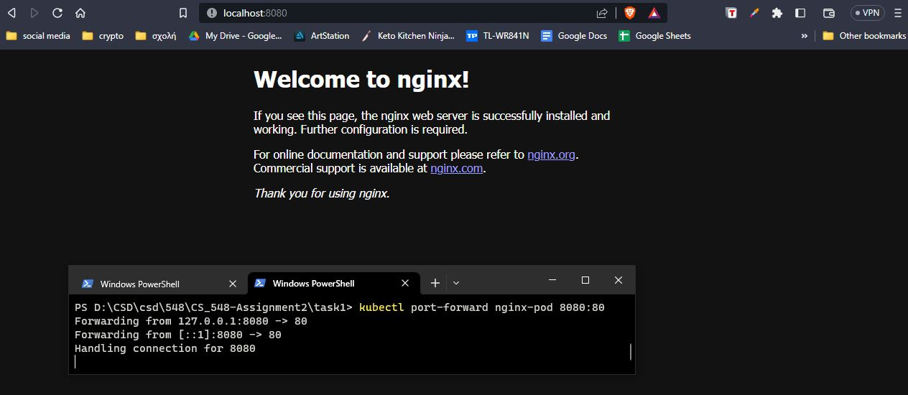
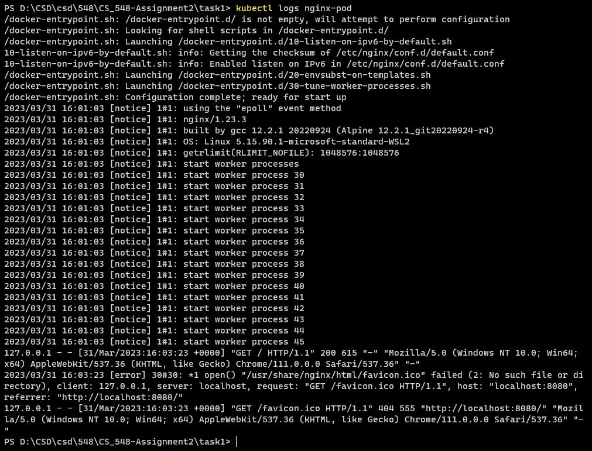
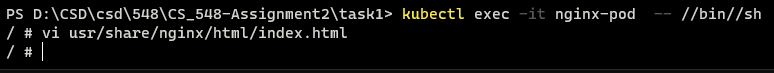
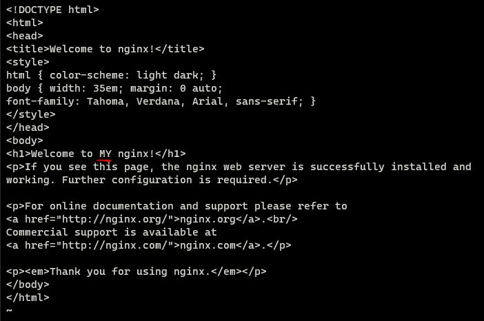
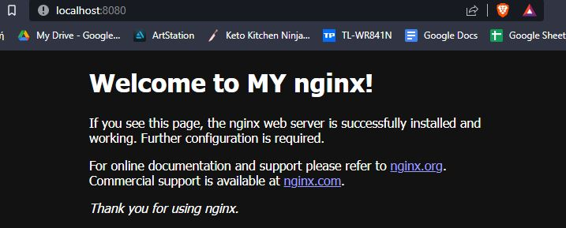
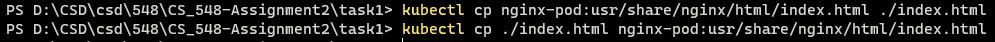
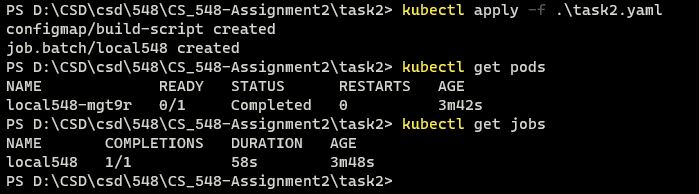
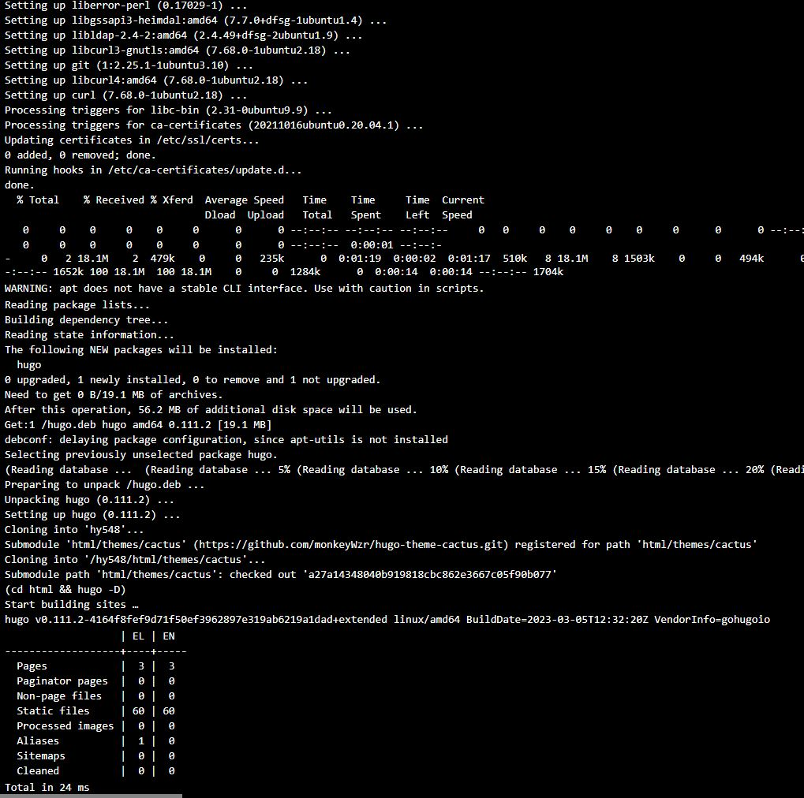

# CS_548-Assignment2
## csd4054

---

### Task 1
  * a)
		
		kubectl apply -f task1.yaml
			
	

  * b)
	
		kubectl port-forward nginx-pod
			
	
		
  * c)
	
		kubectl logs nginx-pod
			
	
		
  * d)
			
		kubectl exec -it nginx-pod  -- //bin//sh
			
	
	
	
		
  * e)
	
		Μεταφορά αρχείου από το container στον τοπικό υπολογιστή:
		kubectl cp nginx-pod:usr/share/nginx/html/index.html ./index.html
			
		Μεταφορά αρχείου από τον τοπικό υπολογιστή στο container:
		kubectl cp ./index.html nginx-pod:usr/share/nginx/html/index.html
			
	
	
		
  * f)
	
		kubectl delete -f task1.yaml
			
	
		
		
### Task 2
  * a)
		Παραθέτω το task2.yaml στον κατάλογο task2. Αρχικά δημιουργώ ένα
		config map οπου φτιάχνει το build-script.sh. Αυτό το script έχει
		τις εντολλές για να κάνει update, να κατεβάσει το git, make, curl,
		να κατεβάσει το hugo και να το εγκαταστήσει, να πάρει το source code
		από το github του μαθήματως και να κάνει build το website.
		Έπειτα είναι ένα job όπου τρέχει σε ένα ubuntu 20.04 container και 
		κάνει mount το config map με το script στο /config και έπειτα 
		τρέχει την εντολή για να εκτελέσει το script και κάνει το build.
		
		Για να δω ότι το Job ολοκληρώθηκε επιτυχώς έτρεξα την εντολή:
		kobectl get pods και βλέπω ότι είναι completed. Επίσης μπορώ
		να δώ και kubectl get jobs ότι έκανε complete χωρίς error 
		καθώς και να δω τα logs του pod που έκανε το build.
	
	
	
	
	
