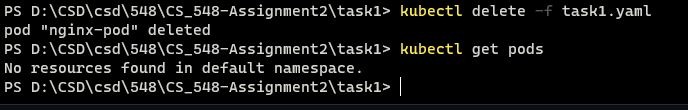

# CS_548-Assignment2
## csd4054

---

### Task 1
  * a)
		
		kubectl apply -f task1.yaml
			
	

  * b)
	
		kubectl port-forward nginx-pod 8080:80
			
	
		
  * c)
	
		kubectl logs nginx-pod
			
	
		
  * d)
			
		kubectl exec -it nginx-pod  -- //bin//sh
			
	
	
	
		
  * e)
	
		Μεταφορά αρχείου από το container στον τοπικό υπολογιστή:
		kubectl cp nginx-pod:usr/share/nginx/html/index.html ./index.html
			
		Μεταφορά αρχείου από τον τοπικό υπολογιστή στο container:
		kubectl cp ./index.html nginx-pod:usr/share/nginx/html/index.html
			
	
	
		
  * f)
	
		kubectl delete -f task1.yaml
			
	
		
		
### Task 2
  * a)

		Παραθέτω το task2.yaml στον κατάλογο task2. Αρχικά δημιουργώ ένα config map οπου φτιάχνει
		το build-script.sh. Αυτό το script έχει τις εντολλές για να κάνει update, να κατεβάσει 
		το git, make, curl, να κατεβάσει το hugo και να το εγκαταστήσει, να πάρει το source code
		από το github του μαθήματως και να κάνει build το website.Έπειτα είναι ένα job όπου τρέχει
		σε ένα ubuntu 20.04 container και κάνει mount το config map με το script στο /config και έπειτα 
		τρέχει την εντολή για να εκτελέσει το script και κάνει το build.
		
		Για να δω ότι το Job ολοκληρώθηκε επιτυχώς έτρεξα την εντολή: kubectl get pods 
		και βλέπω ότι είναι completed. Επίσης μπορώ να δώ και kubectl get jobs ότι έκανε 
		complete χωρίς error καθώς και να δω τα logs του pod που έκανε το build.
	
	
	
	
	
### Task 3
  * a)

		Παραθέτω το task3.yaml στον κατάλογο task3. Άρχικα προσθέτω:
		1 επιπλέον persistentVolumeClaim για να μπουν τα αρχεία του git clone
		1 επιπλέον config map για το script που θα τρέξει το cron job
		1 cron job.
		
		Εκτελώ την εντολή:
		kubectl apply -f .\task3.yaml
		
		Το YAML έχει 2 persistent volume claims. Ένα για τα source code αρχεία του website και
		ένα για τα αρχεία που θα παράξει το hugo από το build του website. Μετά έχω το config map
		οπως την προηγούμενη άσκηση που κάνει το build αλλά έκανα αλλαγές ώστε να κρατάει τα αρχεία
		του source code στο ένα volume claim και τα αρχεία που παράγει το Hugo στο άλλο. Μετά έχω το
		config map του rebuild-script για το cron job όπου τρέχει το git status από το volume που έχει
		το source code και αν υπάρχουν αλλαγές τότε θα κάνει pull και θα καταβάσει το Hugo και Build.
		Επίσης θα ανανεώσει τα αρχεία που θα παράξει το hugo μέσα στο volume. Το job είναι ουσιαστικά
		ίδιο με πριν με την διαφορά ότι κάνει mount και to volume με το source code. Το cron job είναι
		ουσιαστικά ίδιο με το job αλλά τρέχει στις 2:15 κάθε βράδυ όπου εκτελεί το rebuild-script.sh.
		Στην κατασκευή του Pod αλλάζει κάτι.
		
		Ουσιαστικά ο τρόπος που μεταφέρονται τα δεδομένα είναι ότι μέσω των 2 volumes που κατασκευάζουμε
		τα διαφορετικά containers έχουν πρόσβαση στα ίδια δεδομένα καθώς αυτά τα volumes βρίσκονται
		εξωτερικά των containers και υπάρχουν ακόμα και μετά που τα containers έχουν ολοκληρώσει το έργο
		τους. Επομένως όταν κάνουμε clone το source code ή όταν κάνουμε Build αποθηκεύουμε εκεί τα αρχεία
		και μετά μπορούμε να προσπελάσουμε εκείνα τα δεδομένα από το container του pod και δείξουμε το
		website του μαθήματως.
		
		Μπορούμε να δούμε από τα Logs και τα kubectl get pods και logs ότι τα jobs και cron jobs
		εκτελούνται επιτυχώς. Τέλος κάνοντας kubectl port-forward local548 8080:80 μπορούμε να
		δούμε ότι το website είναι up και λειτουργικό.
		
	
	
	
	

### Task 4
  * a)

		Παραθέτω το task4.yaml στον κατάλογο task4. Οι διαφορές με το προηγούμενο ερώτημα είναι ότι δημιούργησα
		το deployment και μετέφερα εκεί το container που θα γίνεται host το website. Επίσης δημιουργώ ένα
		"wait-container" που παίρνει ένα budybox image (750Kb compress size) που τρέχει το wait-script.sh
		(script που κάνει mount από ένα νέο config map που έφτιαξα), το οποίο τρέχει ένα loop κάθε 15 δευτερόλεπτα
		και ελέγχει εάν έχουν μεταφερθεί θα αρχεία που έφτιαξε το hugo ή όχι. Όταν μεταφερθούν τα αρχεία και το δεί
		το wait-script τότε τερματίζει και τρέχει το nginx-container που κάνει Mount τα html αρχεία και τρέχει το site.
		Όπως και πριν κάνω port forward και ελέγχω τα logs και τα pods για να επιβεβαιωθώ ότι το deployment εκτελέστηκε
		σωστά. Επίσης με Kubectl get services -o wide μπορούμε να δούμε το νέο service για το app μας.
		
	
	

